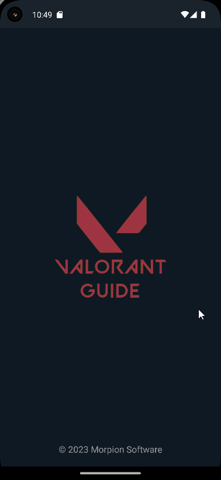
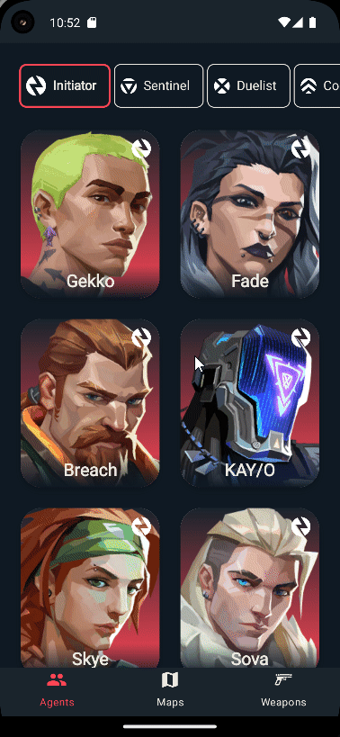
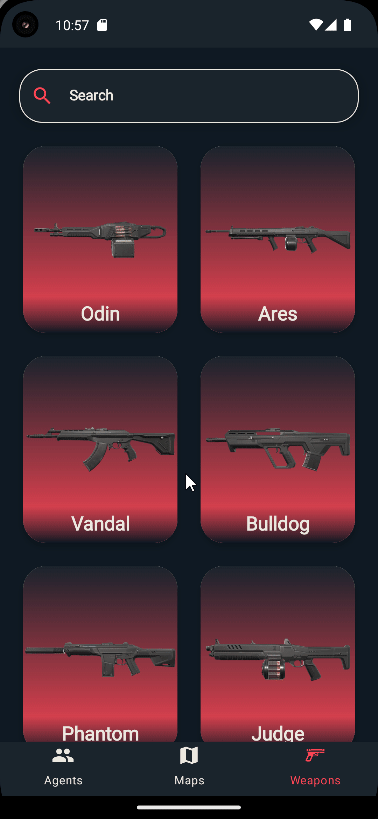
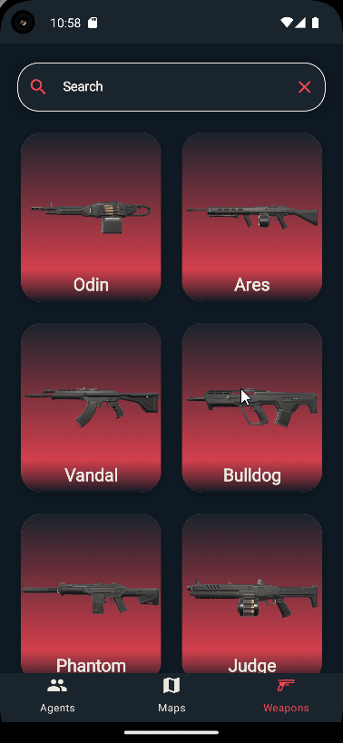

# Valorant Guide

The Android application I developed to guide players in the Valorant game using the [Valorant-API](https://valorant-api.com/) incorporates the following technologies and libraries:

<b>-Jetpack Compose:</b> Jetpack Compose has been utilized to achieve a modern and compelling user interface (UI) design. This technology facilitates the creation of advanced UI components. 
<b>-MVVM - Clean Architecture:</b> The application is developed based on the Model-View-ViewModel (MVVM) architecture and Clean Architecture principles. This approach contributes to the organization and sustainability of the code. 
<b>-Flow:</b> Kotlin Flow is employed to manage data flow and implement reactive programming principles. This ensures the effective operation of the application in asynchronous operations. 
<b>-Dagger Hilt:</b> Dagger Hilt is used for dependency injection, enabling the application to be modular and effectively manage dependencies. 
<b>-Retrofit and Okhttp:</b> The application makes use of Retrofit and Okhttp libraries for network calls. This ensures secure and efficient communication with the Valorant API. 
<b>-Glide:</b> The Glide library is employed for loading and displaying images. This enables the application to manage visual content effectively. 

## Download

## Screens

| Splash |
| ------- |
||

 

| Agents | Agent Detail |
| ------- | ------- | 
|||

 

| Maps |
| ------- |
||

 

| Weapons | Weapons Detail |
| ------- | ------- |
|||

 
